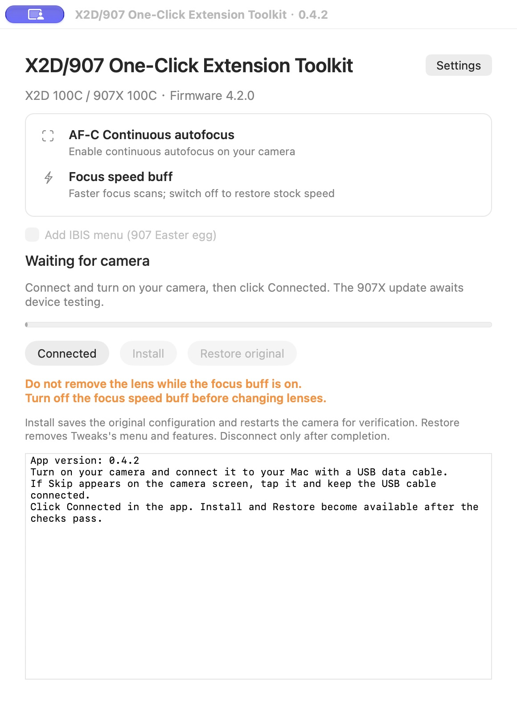
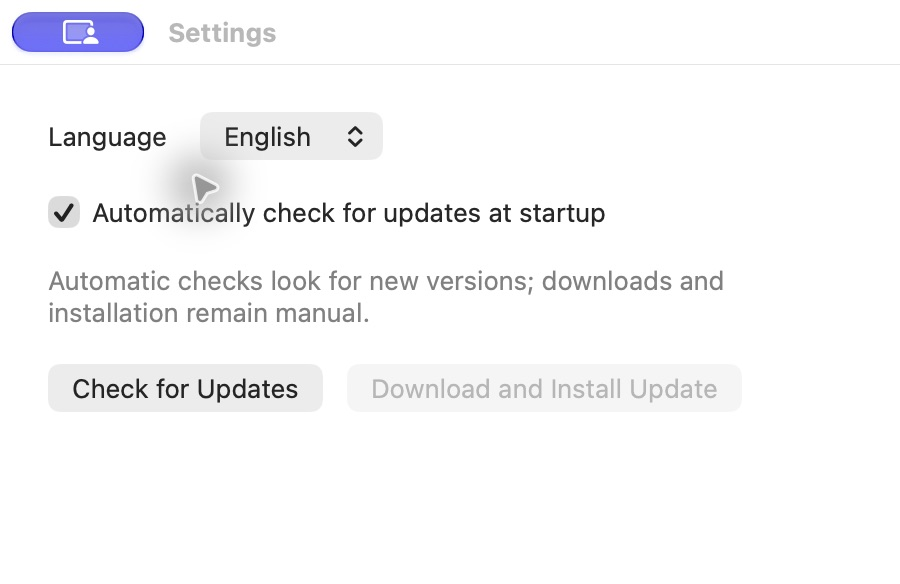
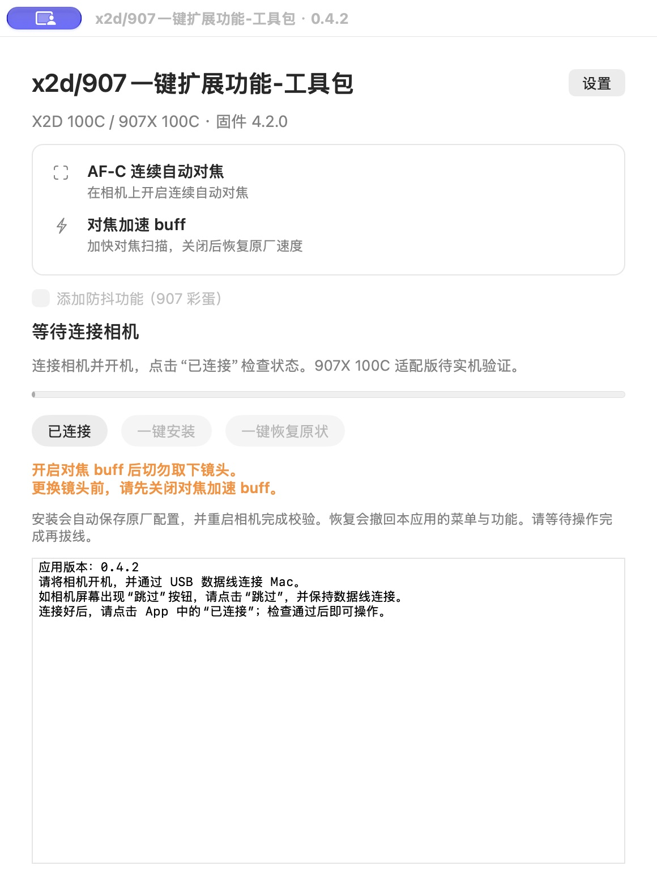

# X2D/907 One-Click Extension Toolkit

**X2D/907 One-Click Extension Toolkit (x2d/907一键扩展功能-工具包)** is an experimental macOS and Windows utility for the first-generation **X2D 100C** and **907X & CFV 100C**, targeting stock firmware **4.2.0**.

Camera menu labels follow the app language at install time: English installs **Tweaks**, Chinese installs **耍起功能**.

[中文说明](#中文说明) · [Changelog / 更新日志](CHANGELOG.md) · [Build and test](docs/BUILD.md) · [Validation](docs/VALIDATION.md)

## Features

- **AF-C continuous autofocus:** adds a camera-side availability switch. The stock AF-S / MF layout returns when disabled.
- **Focus speed buff:** faster focus scans, with stock speed restored when disabled.
- **Install / Restore original:** checks the camera and package, saves the original startup configuration, then restarts and verifies the result.
- **Settings and updates:** in Settings, startup checks default to on and can be disabled; the choice is remembered. Manual checking remains available when automatic checks are off. A separate Download and Install Update action fetches the latest stable GitHub Release for your platform, verifies its SHA-256 digest, then installs and relaunches the app. Camera operations and app updates cannot run together. The previous app is retained beside the installation. Updates change the desktop app; updating an installed camera extension still requires **Connected → Install**.
- **Chinese / English:** switch the desktop interface and logs in Settings; the preference survives app restarts. **Install** writes matching Chinese or English camera menu labels. Changing the camera language requires another install.
- **907 IBIS entry (Easter egg):** available after a verified 907 connection; its menu label follows the installed language.

**Do not remove the lens while the focus buff is enabled. Disable it before changing lenses.**

## Getting started

1. Extract the complete application package. macOS requires 13 or later (Apple silicon / Intel); Windows requires 64-bit Windows 10 / 11.
2. Turn on the camera and connect a USB data cable. Tap **Skip** if shown on the camera. A camera-side **Mass storage** selection can also retain the factory connection.
3. Click **Connected**. Install and Restore remain disabled until connection and firmware checks pass. Windows requests administrator access and attempts to prepare the supported camera factory interface automatically; the ADB interface is separate.
4. Optionally select the 907 IBIS entry (Easter egg), then click **Install**. Keep the camera powered and connected through restart and verification.
5. Disconnect only when the app reports completion. Open **Tweaks** (English install) or **耍起功能** (Chinese install) at the end of the camera menu, enable its master switch, then choose AF-C or the focus buff.
6. To remove the extension, reconnect, click **Connected**, then **Restore original**. This reverses this application's changes; it is not a complete firmware recovery tool.

X2D uses tile **12**. The 907 uses tile **11** normally, or **12** with the optional Easter egg installed. Changing the Easter egg choice or the camera menu language requires another installation; recognized older packages are restored before upgrade.

When an existing extension must be restored before reinstallation, the app asks for confirmation in the **target camera menu language**. The dialog explains restoration, disabled feature switches and restarts. Cancel leaves the camera unchanged. A first installation or an unchanged installation does not need this dialog.

The repository contains application source, tests and screenshots. Vendor firmware, extracted compiled QML, runtime libraries, generated camera payloads and desktop installation archives are excluded. Desktop packages are available from [GitHub Releases](https://github.com/radium-wang/x2d-907-one-click-extension-toolkit/releases/latest). Updates require a writable application folder; if needed, move the complete app to a folder you own. The Mac build uses an ad-hoc signature and is not notarized; the Windows launcher is unsigned.

## Screenshot — English

Actual macOS 0.4.2 window in the disconnected state. The 907 checkbox is intentionally disabled until identification succeeds.

## Verification status

Earlier X2D installations, menu behavior and restoration have device/user evidence. The current 0.4.2 changes passed offline connection, transaction, localization and menu tests. The 907 Easter egg, 907 menu adaptation, AF-S retention across power cycles and automatic Windows driver preparation still require device validation. A desktop test is not a camera test. See [the evidence boundaries](docs/VALIDATION.md).

This is an independent project, not an official Hasselblad product. Eye recognition is not included. Other camera generations and firmware versions are unsupported.

## Support development

If this toolkit helps you, you can [support its development via PayPal](https://paypal.me/RadiumWang). Donations are voluntary. Thank you for supporting ongoing development and maintenance!

---

## 中文说明

**x2d/907一键扩展功能-工具包** 是面向第一代 **X2D 100C** 和 **907X & CFV 100C** 的实验性 Mac / Windows 工具，仅适配经过校验的原厂 **4.2.0** 固件。

相机菜单文案随安装时的 App 语言：中文安装为“耍起功能”，英文安装为 Tweaks。

### 当前功能

- **AF-C 连续自动对焦**：在相机上控制连续对焦入口；关闭后恢复原厂 AF-S / 手动对焦布局。
- **对焦加速 buff**：加快对焦扫描，关闭后恢复原厂速度。
- **一键安装 / 一键恢复原状**：检查连接与文件，保存原厂启动配置，并在重启后校验结果。
- **设置与更新**：在设置页选择语言、关闭或开启启动自动检查更新（默认开启并保存选择）；关闭后仍能手动检查。下载安装需另行点击，从 GitHub Release 获取对应系统的稳定版，校验 SHA-256 后安装并重新打开；保留上一版 App，更新与相机操作互斥。更新只替换电脑端软件；相机上的扩展需再点击 **已连接 → 一键安装** 更新。
- **中英文切换**：在设置中选择语言，桌面界面、操作提示和日志随语言切换，重启 App 后保留选择；**一键安装** 会写入对应语言的相机菜单文案，更换相机语言需重新安装。
- **907 防抖入口（彩蛋）**：识别到 907 后可选择添加；入口名称随安装语言变化。

**开启对焦 buff 后切勿取下镜头。更换镜头前，请先关闭对焦加速 buff。**

### 使用方法

1. 完整解压软件。Mac 支持 macOS 13 及以上、Apple 芯片与 Intel；Windows 支持 64 位 Windows 10 / 11。
2. 开机并插入 USB 数据线；相机出现“跳过”时点击“跳过”。在相机屏幕选择“大容量存储”也可能保留工厂通信连接。
3. 点击 **已连接**。检查通过后才启用安装和恢复按钮。Windows 会请求管理员权限，并尝试自动准备支持的相机工厂接口驱动；ADB 是另一个独立接口。
4. 907 用户可选勾防抖入口（彩蛋），然后点击 **一键安装**。重启及校验期间保持供电和连接。
5. App 提示完成后才拔线。在相机主菜单末尾进入 **耍起功能**，先开启主开关，再选择 AF-C 或对焦加速 buff。
6. 需要撤回时重新连接，点击 **已连接 → 一键恢复原状**。恢复仅撤回本软件的改动，不是整机固件救援。

X2D 的功能入口在第 **12** 格；907 默认第 **11** 格，勾选彩蛋后移到第 **12** 格。改变彩蛋选项或相机菜单语言后需重新安装；已识别旧版会先恢复再升级。

需要先恢复再安装时，App 会按 **目标相机菜单语言** 弹出确认，说明恢复、功能开关关闭和重启流程。取消后不修改相机。首次安装或现有安装配置未变化时不弹此确认。

### 软件截图 — 中文

这是 macOS 0.4.2 的实际界面截图，当前未连接相机，因此 907 勾选项和写入按钮处于禁用状态。

### 验证与源码范围

早期 X2D 安装、菜单和恢复已有实机或用户反馈；0.4.2 的连接门槛、事务、翻译和菜单路由已通过离线检查。**907 彩蛋、907 菜单适配、关机后保留 AF-S，以及 Windows 自动驱动准备仍待实机验证。** 具体范围见 [验证说明](docs/VALIDATION.md)。

本库只收录应用源码、测试和软件截图，不包含原厂固件、提取的编译 QML、运行库、生成的相机载荷或桌面安装压缩包。桌面安装包见 [GitHub Releases](https://github.com/radium-wang/x2d-907-one-click-extension-toolkit/releases/latest)。更新需要应用目录可写；如提示权限不足，请将完整 App 移到自己的可写目录后重试。Mac 使用临时签名、未经公证；Windows 启动器未经代码签名。构建输入见 [构建说明](docs/BUILD.md)。

本项目为独立研究工具，非哈苏官方软件。目前不含眼部识别；不适配其他代机型或固件。

### 支持开发

如果这个工具对你有帮助，欢迎通过 [PayPal 自愿赞助](https://paypal.me/RadiumWang)，支持后续开发与维护。感谢支持！
