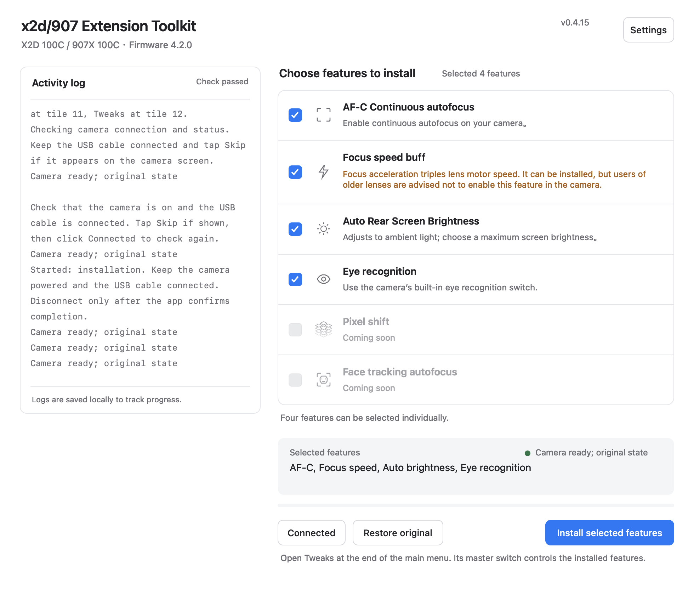

# X2D/907 One-Click Extension Toolkit

## 一键工具包 · 下载 / One-click toolkit

**[下载 Windows / macOS 最新版 →](https://github.com/radium-wang/x2d-907-one-click-extension-toolkit/releases/latest)**

[平台下载及更新说明 / Downloads & release notes](#download--下载软件) · [中文使用说明](#中文说明) · [English setup](#getting-started)

## 赞助开发 / Support development

**[PayPal 赞助 →](https://paypal.me/RadiumWang) · [支付宝收款码 →](#support-development)**

赞助完全自愿，用于支持持续研究、工具开发和维护；获取工具与使用功能不以付款为条件。 Donations are voluntary and support ongoing research, development and maintenance.

---

**X2D/907 One-Click Extension Toolkit (x2d/907一键扩展功能-工具包)** is an experimental macOS and Windows utility for the first-generation **X2D 100C** and **907X & CFV 100C**, targeting stock firmware **4.2.0**.

Camera menu text follows the app language at install time: English installs **Tweaks**; Simplified and Traditional Chinese install **耍起功能** with their respective feature labels and messages.

[中文说明](#中文说明) · [Changelog / 更新日志](CHANGELOG.md) · [Build and test](docs/BUILD.md) · [Validation](docs/VALIDATION.md)

## Download / 下载软件

**Latest version: 0.4.15 / 最新版本：0.4.15**

- [**Download for Windows 10/11 (64-bit) / 下载 Windows 版 (.zip)**](https://github.com/radium-wang/x2d-907-one-click-extension-toolkit/releases/download/v0.4.15/x2d-907-extension-toolkit-Windows-x64-0.4.15.zip)
- [**Download for macOS 13+ (Apple silicon and Intel) / 下载 Mac 版 (.zip)**](https://github.com/radium-wang/x2d-907-one-click-extension-toolkit/releases/download/v0.4.15/x2d-907-extension-toolkit-macOS-Universal-0.4.15.zip)

Only the latest installer packages containing the free-project notice are retained for download; historical release notes remain available. 仅保留带免费项目提示的最新安装包供下载，历史更新说明继续保留。

Extract the entire ZIP before opening the app. 下载后请完整解压，再启动软件。 [Release notes / 更新说明](https://github.com/radium-wang/x2d-907-one-click-extension-toolkit/releases/tag/v0.4.15) · [SHA-256 checksums / 校验文件](https://github.com/radium-wang/x2d-907-one-click-extension-toolkit/releases/download/v0.4.15/SHA256SUMS)

Version 0.4.15 adds optional Eye Recognition using the stock debug switch, plus disabled Coming soon cards for Pixel Shift and Face Tracking Autofocus on Mac and Windows. Enable stock face detection for eye boxes; this does not add tracking autofocus. The first-use free-project notice remains in all three languages. See [firmware audit](docs/EYE-AUDIT.md) and [release notes](CHANGELOG.md). The new Eye switch has not been tested on a physical camera.

0.4.15 在 Mac、Windows 加入可选的原厂人眼识别开关，以及灰色“即将到来”的像素位移、人脸追踪对焦卡片。显示眼框还需开启原厂人脸检测；眼框不等于跟随对焦。三语言首次免费提示继续保留，见[固件核查](docs/EYE-AUDIT.md)及[更新说明](CHANGELOG.md)。新增人眼开关尚未实机测试。

## Features

- **AF-C continuous autofocus:** adds a camera-side availability switch. The stock AF-S / MF layout returns when disabled.
- **Focus speed buff:** faster focus scans, with stock speed restored when disabled.
- **Auto Brightness (0.4.3):** enable “Add Auto Brightness to Menu” in Tweaks, then control Auto in Display → Brightness. The rear slider sets the maximum; the knob stays there while its white fill tracks current output. The master switch controls availability; default off.
- **Eye Recognition (0.4.15, optional):** adds a Tweaks switch for the stock EyeDetection debug option. Enable face detection in the original camera menu first. The switch reports the actual setting; eye boxes do not establish tracking autofocus. Installation leaves the original setting unchanged.
- **Coming soon:** Pixel Shift and Face Tracking Autofocus have gray, disabled checkboxes and are not installed.
- **Install / Restore original:** checks the camera and package, saves the original startup configuration, then restarts and verifies the result.
- **Settings and updates:** in Settings, startup checks default to on and can be disabled; the choice is remembered. Manual checking remains available when automatic checks are off. A separate Download and Install Update action fetches the latest stable GitHub Release for your platform, verifies its SHA-256 digest, then installs and relaunches the app. Camera operations and app updates cannot run together. The previous app is retained beside the installation. Updates change the desktop app; updating an installed camera extension still requires **Connected → Install**.
- **Simplified Chinese / Traditional Chinese / English (0.4.7):** switch the desktop interface and logs in Settings; the preference survives app restarts. **Install** writes matching camera menu text. Changing the camera language requires another install.
- **Windows connection and exit fixes (0.4.6):** correct the private ADB listener address that prevented installation in 0.4.5. Closing during a read-only update check cancels the check. Camera install/restore uses an owned private ADB process that is cleaned up afterward; camera/driver work and update installation retain exit protection.
- **Windows interface (0.4.4):** Mac-aligned feature cards, rounded buttons and Settings, with bilingual typography, per-monitor DPI scaling and scrolling on short displays. The camera payload is unchanged from 0.4.3, so existing 0.4.3 camera installations do not need reinstallation.
- **907 IBIS entry (Easter egg):** checked by default after verifying a stock 907. For a recognized existing installation, its recorded choice is retained, including an unchecked choice. You can uncheck it before installation; its menu label follows the installed language.

The first three features are selected by default; Eye Recognition is a fourth optional choice. Unselected rows stay hidden in Tweaks. Turning off Tweaks or restoring the extension reverses the Eye settings still owned by the toolkit, including a pre-existing Eye bit. Other active debug options are retained; conflicting external changes stop restoration rather than being overwritten. See the [restoration details](docs/EYE-AUDIT.md).

**Focus acceleration triples lens motor speed. It can be installed, but users of older lenses are advised not to enable this feature in the camera.** The same guidance appears below the camera switch. Use Connected → Install after the desktop update to apply camera changes.

## Getting started

1. Extract the complete application package. macOS requires 13 or later (Apple silicon / Intel); Windows requires 64-bit Windows 10 / 11.
2. Turn on the camera and connect a USB data cable. Tap **Skip** if shown on the camera. A camera-side **Mass storage** selection can also retain the factory connection.
3. Click **Connected**. Install and Restore remain disabled until connection and firmware checks pass. Windows requests administrator access and attempts to prepare the supported camera factory interface automatically; the ADB interface is separate.
4. Select the wanted features; AF-C, focus acceleration and rear brightness are selected by default, while Eye Recognition is optional. The 907 IBIS entry remains optional. Click **Install selected features** and keep the camera powered and connected through restart and verification.
5. Disconnect only when the app reports completion. Open **Tweaks** (English install) or **耍起功能** (Chinese install) at the end of the camera menu, enable its master switch, then the installed features you need. For Eye Recognition, also enable face detection in the original camera menu. Select Traditional Chinese in Settings before installing to get Traditional Chinese camera text.
6. To remove the extension, reconnect, click **Connected**, then **Restore original**. This reverses this application's changes; it is not a complete firmware recovery tool.

X2D uses tile **12**. On the 907, Tweaks uses tile **12** with the IBIS entry selected, or **11** if it is unselected. Changing the Easter egg choice or the camera menu language requires another installation; recognized older packages are restored before upgrade.

When an existing extension must be restored before reinstallation, the app asks for confirmation in the **target camera menu language**. The dialog explains restoration, disabled feature switches and restarts. Cancel leaves the camera unchanged. A first installation or an unchanged installation does not need this dialog.

The repository contains application source, tests and screenshots. Vendor firmware, extracted compiled QML, runtime libraries, generated camera payloads and desktop installation archives are excluded. Desktop packages are available from [GitHub Releases](https://github.com/radium-wang/x2d-907-one-click-extension-toolkit/releases/latest). Updates require a writable application folder; if needed, move the complete app to a folder you own. The Mac build uses an ad-hoc signature and is not notarized; the Windows launcher is unsigned.

## Screenshot — English

Native macOS 0.4.15 views rendered in offline UI checks. Camera status is substituted; these software screenshots are not physical camera validation. Eye Recognition is selected here to show its installation summary.

907 selection preview using offline stock-camera status. 原厂 907 状态替身预览，彩蛋可取消勾选。

## Verification status

Earlier X2D installations, menu behavior and restoration have device/user evidence. The optional 0.4.15 Eye switch has firmware analysis and offline worker/QML checks, but no physical camera test. Traditional Chinese desktop text, confirmation and camera overlays have offline checks; native Windows display and physical camera installation in Traditional Chinese remain unverified. The 0.4.3 camera functionality has Qt menu/brightness checks and native Mac layout evidence. Native Windows ADB startup, shutdown/directory release, rendering and accessibility, auto brightness on the physical display, X2D/CFV boot and restoration, the 907 menu/Easter egg, AF-S retention across power cycles and automatic Windows driver preparation still require native/device validation. A desktop test is not a camera test. See [the evidence boundaries](docs/VALIDATION.md).

This is an independent project, not an official Hasselblad product. Optional Eye Recognition exposes the existing stock debug option and adds no eye- or face-tracking autofocus. The historical 0.4.8 audit found no eye/debug writer in that version; see the [audit](docs/EYE-AUDIT.md). Other camera generations and firmware versions are unsupported.

## License

New versions carrying the [X2D/907 Noncommercial Distribution License 1.0](LICENSE) allow use, study, modification and free redistribution. **Professional photography, including paid shoots and selling photographs, is allowed. Selling the software or modified versions, charging for software access, and paid installation/setup services require separate written permission.** Truly voluntary donations are allowed; access, features or installation must not depend on payment.

This is a **source-available** project with restrictions on software commercialization; the license is not OSI-approved open source. Previously released MIT versions keep their original permissions. Third-party components keep their own licenses; see [third-party notices](THIRD_PARTY_NOTICES.md). Existing published 0.4.2 archives are unchanged by this repository license update.

## Support development

If this toolkit helps you, you can support its development via [PayPal](https://paypal.me/RadiumWang) or Alipay. Donations are voluntary. Thank you for supporting ongoing development and maintenance!

**Alipay:** scan the QR code below with Alipay, or save the image and open it in Alipay's scanner.

---

## 中文说明

**x2d/907一键扩展功能-工具包** 是面向第一代 **X2D 100C** 和 **907X & CFV 100C** 的实验性 Mac / Windows 工具，仅适配经过校验的原厂 **4.2.0** 固件。

相机菜单文案随安装时的 App 语言：简体、繁体中文安装为“耍起功能”（功能名称与提示使用所选字形），英文安装为 Tweaks。

**下载安装包：**[Windows 10/11（64 位）](https://github.com/radium-wang/x2d-907-one-click-extension-toolkit/releases/download/v0.4.15/x2d-907-extension-toolkit-Windows-x64-0.4.15.zip) · [macOS 13 及以上（Apple 芯片 / Intel）](https://github.com/radium-wang/x2d-907-one-click-extension-toolkit/releases/download/v0.4.15/x2d-907-extension-toolkit-macOS-Universal-0.4.15.zip)。下载后请完整解压，再启动软件。

### 当前功能

- **AF-C 连续自动对焦**：在相机上控制连续对焦入口；关闭后恢复原厂 AF-S / 手动对焦布局。
- **对焦加速**：加快对焦扫描，关闭后恢复原厂速度。
- **后屏自动亮度（0.4.3）**：在耍起功能中开启“在亮度菜单中加入自动亮度”，之后在显示 → 亮度中控制自动模式。滑块圆球设置最高亮度，白线跟随当前输出；受总开关控制、默认关闭。
- **人眼识别（0.4.15，可选）**：安装后在耍起功能中控制原厂 EyeDetection 调试选项；还需在原厂菜单开启人脸检测。开关显示实际回读状态，眼部框不等于跟随对焦，安装本身不启用该选项。
- **即将到来**：像素位移和人脸追踪对焦使用灰色禁用勾选框，不能选择，不安装相关功能。
- **一键安装 / 一键恢复原状**：检查连接与文件，保存原厂启动配置，并在重启后校验结果。
- **设置与更新**：在设置页选择语言、关闭或开启启动自动检查更新（默认开启并保存选择）；关闭后仍能手动检查。下载安装需另行点击，从 GitHub Release 获取对应系统的稳定版，校验 SHA-256 后安装并重新打开；保留上一版 App，更新与相机操作互斥。更新只替换电脑端软件；相机上的扩展需再点击 **已连接 → 一键安装** 更新。
- **简体中文／繁體中文／English（0.4.7）**：在设置中选择语言，桌面界面、操作提示和日志随语言切换，重启 App 后保留选择；**一键安装** 会写入对应语言的相机菜单文案，更换相机语言需重新安装。
- **Windows 连接与退出修复（0.4.6）**：修正 0.4.5 导致安装无法开始的独立 ADB 监听地址；普通检查更新期间可关闭窗口并取消检查。相机安装/恢复使用本软件管理的独立 ADB 进程，操作结束后回收；相机/驱动操作及更新安装期间仍保留退出保护。
- **Windows 界面（0.4.4）**：功能卡片、圆角按钮和设置页对齐 Mac，适配中英文字体、显示器 DPI 缩放及小屏幕滚动。相机载荷与 0.4.3 相同，已有 0.4.3 相机安装无需重装。
- **907 防抖入口（彩蛋）**：确认原厂 907 后默认勾选；已有已识别安装时保留记录中的选择，包括此前未勾选的状态。安装前仍可取消；入口名称随安装语言变化。

默认选择前三项功能，人眼识别是第四项可选功能；未选择的功能行不会出现在耍起功能中。关闭总开关或恢复软件时，撤回本工具仍持有的人眼设置，包括恢复原先已开启的 Eye 位；保留其他当前调试位，遇外部设置冲突则停止而不覆盖，见[恢复逻辑](docs/EYE-AUDIT.md)。

**对焦加速通过将镜头转速提高三倍实现，可安装，但不建议老镜头用户在相机内开启该功能。** 相机开关下方也有这段说明；电脑端升级后点击“已连接 → 一键安装”更新相机功能。

### 使用方法

1. 完整解压软件。Mac 支持 macOS 13 及以上、Apple 芯片与 Intel；Windows 支持 64 位 Windows 10 / 11。
2. 开机并插入 USB 数据线；相机出现“跳过”时点击“跳过”。在相机屏幕选择“大容量存储”也可能保留工厂通信连接。
3. 点击 **已连接**。检查通过后才启用安装和恢复按钮。Windows 会请求管理员权限，并尝试自动准备支持的相机工厂接口驱动；ADB 是另一个独立接口。
4. 默认选择 AF-C、对焦加速及后屏自动亮度，可另选人眼识别；907 防抖入口仍为可选项。点击 **安装所选功能**，重启及校验期间保持供电和连接。
5. App 提示完成后才拔线。在相机主菜单末尾进入 **耍起功能**，先开启主开关，再开启所需的已安装功能。使用人眼识别还需在原厂菜单开启人脸检测。若希望相机使用繁体中文，请在安装前到设置页选“繁體中文”。
6. 需要撤回时重新连接，点击 **已连接 → 一键恢复原状**。恢复仅撤回本软件的改动，不是整机固件救援。

X2D 的功能入口在第 **12** 格；907 勾选防抖入口时，耍起功能在第 **12** 格，取消时在第 **11** 格。改变彩蛋选项或相机菜单语言后需重新安装；已识别旧版会先恢复再升级。

需要先恢复再安装时，App 会按 **目标相机菜单语言** 弹出确认，说明恢复、功能开关关闭和重启流程。取消后不修改相机。首次安装或现有安装配置未变化时不弹此确认。

### 软件截图 — 中文

这是 0.4.15 的原生 macOS 界面，使用离线相机状态替身渲染；图中选中人眼识别用于展示安装摘要，不代表实机验证。

### 验证与源码范围

早期 X2D 安装、菜单和恢复已有实机或用户反馈；0.4.15 可选人眼开关已有固件分析、离线服务与 QML 检查，尚未实机测试。繁体桌面文案、确认弹窗和相机菜单文件已离线校验；Windows 原生繁体显示与相机实装仍待验证。0.4.3 相机功能另有 Qt 菜单/亮度检查和 Mac 原生布局证据。**Windows 原生 ADB 启动、退出与目录释放、显示与可访问性、实际后屏自动亮度、X2D/CFV 启动与恢复、907 菜单/彩蛋、关机后保留 AF-S，以及 Windows 自动驱动准备仍待原生或实机验证。** 具体范围见 [验证说明](docs/VALIDATION.md)。

本库只收录应用源码、测试和软件截图，不包含原厂固件、提取的编译 QML、运行库、生成的相机载荷或桌面安装压缩包。桌面安装包见 [GitHub Releases](https://github.com/radium-wang/x2d-907-one-click-extension-toolkit/releases/latest)。更新需要应用目录可写；如提示权限不足，请将完整 App 移到自己的可写目录后重试。Mac 使用临时签名、未经公证；Windows 启动器未经代码签名。构建输入见 [构建说明](docs/BUILD.md)。

本项目为独立研究工具，非哈苏官方软件。可选人眼识别使用原厂调试选项，不加入人眼或人脸跟随对焦；0.4.8 未加入人眼调试写入的历史结论仍有效，见[核查说明](docs/EYE-AUDIT.md)。不适配其他代机型或固件。

### 许可

后续携带 [X2D/907 非商业分发许可证 1.0](LICENSE) 的版本允许使用、研究、修改和免费分享。**允许用于收费拍摄、摄影工作室及出售摄影作品；出售软件或改版、收费提供软件访问，以及收费安装、设置服务须另获作者书面授权。** 允许自愿赞助，但不得把付款作为获取软件、使用功能或获得安装服务的条件。

这是限制软件商业化的**源码公开（source-available）**项目，许可证不属于 OSI 认可的开源许可证。此前已按 MIT 发布的版本仍保留原许可；第三方组件沿用各自许可，见 [第三方说明](THIRD_PARTY_NOTICES.md)。本次仓库许可更新不修改已发布的 0.4.2 安装包。

### 支持开发

如果这个工具对你有帮助，欢迎通过 [PayPal](https://paypal.me/RadiumWang) 或支付宝自愿赞助，支持后续开发与维护。感谢支持！

**支付宝：**打开支付宝扫一扫，扫描下方收款码；也可以保存图片，在扫一扫中从相册选择。

